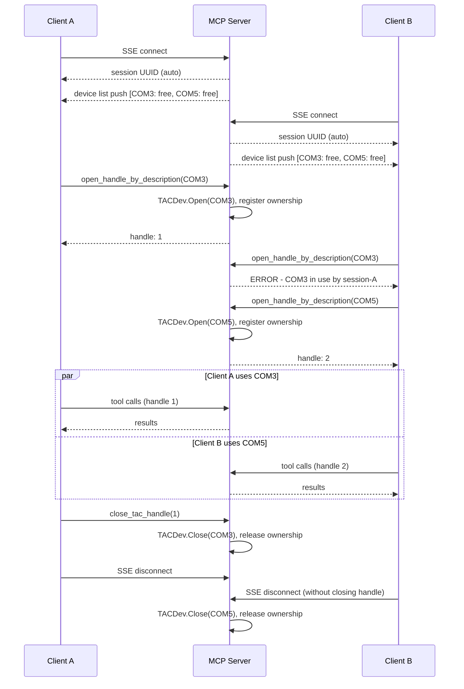

# QTAC MCP Server

An [MCP](https://modelcontextprotocol.io) server that exposes the full TACDev API as tools,
allowing AI assistants and automation clients to control Qualcomm devices via a QTAC debug board.

## Architecture

A persistent SSE server. Multiple clients connect concurrently, each identified by a UUID session.
Each client can open one or more devices. A device can only be held by one session at a time.
On disconnect, the server closes any devices the session left open.



## Prerequisites

| Requirement | Details |
| :-- | :-- |
| Python | 3.10+ matching your target architecture (x64 Python on x64, ARM64 Python on ARM64) |
| QTAC build | Project must be built with `build.bat` / `build.sh` - TACDev library is loaded from `__Builds` |

## Setup

| Platform | Command |
| :-- | :-- |
| Windows x64 (auto-detected) | `setup.bat` |
| Windows ARM64 (auto-detected) | `setup.bat` |
| Linux | `./setup.sh` |

Each script auto-detects architecture, checks for an existing build, installs the TACDev Python
library, and installs MCP dependencies. On ARM64 Windows, OpenSSL is downloaded and installed
automatically if not already present.

For full setup guidance see [Bootcamp guide](../../docs/bootcamp/01-Bootcamp.md) and
[Python API reference](../../docs/bootcamp/02-Python-API.md).

## Configuration

All runtime parameters are in `config.yaml`:

| Parameter | Default | Description |
| :-- | :-- | :-- |
| `server.host` | `127.0.0.1` | Host to bind the server on |
| `server.port` | `8000` | Port the server listens on |
| `logging.file` | `tacdev_mcp.log` | Log file path |
| `logging.level` | `INFO` | Log level: DEBUG, INFO, WARNING, ERROR |
| `logging.max_bytes` | `10485760` | Max log file size before rotation (10 MB) |
| `logging.backup_count` | `5` | Number of rotated backup files to retain |

## Usage

**Start the server** (must be running before any client connects):

```bash
python examples/MCP/tacdev_mcp_server.py
```

**Run the client demo:**

```bash
python examples/MCP/tacdev_mcp_client.py             # opens first available device
python examples/MCP/tacdev_mcp_client.py COM41        # opens specific port
```

**Use as a library:**

```python
import asyncio
from tacdev_mcp_client import TACDevClient

async def main():
    async with TACDevClient() as tac:
        devices = await tac.list_devices()
        handle = await tac.open_handle_by_description("COM41")
        await tac.power_on_button(handle)
        await tac.close_tac_handle(handle)

asyncio.run(main())
```

## Troubleshooting

| Error | Fix |
| :-- | :-- |
| `ModuleNotFoundError: No module named 'TACDev'` | Run `pip install interfaces/Python` from the repo root, or use `setup.bat` / `setup.sh` |
| `TACDev library not found` | Build the project first with `build.bat` / `build.sh` and run from repo root |
| `Architecture mismatch` | Use Python matching your target architecture (x64 or ARM64) |
| `ModuleNotFoundError: No module named 'fastmcp'` | Requires Python 3.10+. Run `pip install -r requirements.txt` |
| `cryptography` build failure on ARM64 | Re-run `setup.bat` - it downloads and installs OpenSSL automatically. If it still fails, install manually from [slproweb.com](https://slproweb.com/download/Win64ARMOpenSSL-4_0_1.msi) (full installer, not Light) and set `OPENSSL_DIR=C:\Program Files\OpenSSL-Win64-ARM` |
| `get_device_count` returns 0 | Check debug board is connected. On Windows run `FTDICheck.exe` from `__Builds\x64\Release\bin`. On Linux: `sudo cp udev-rules/99-QTAC-USB.rules /etc/udev/rules.d/ && sudo udevadm control --reload` |

See [Bootcamp troubleshooting](../../docs/bootcamp/01-Bootcamp.md#troubleshooting) for more.
