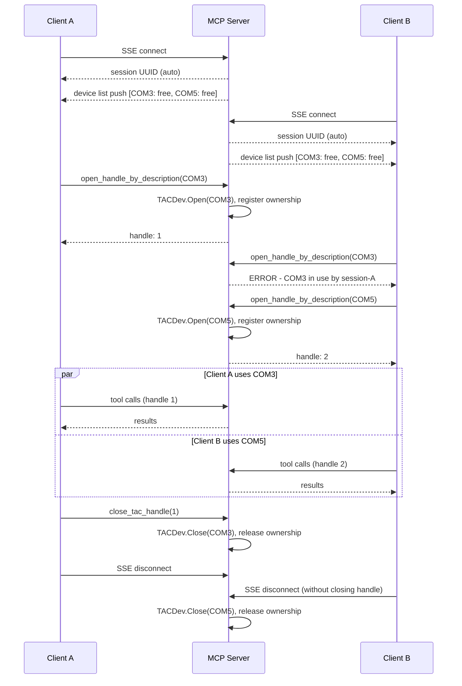

# QTAC MCP Server

An [MCP](https://modelcontextprotocol.io) server that exposes the full TACDev API as tools,
allowing AI assistants and automation clients to control Qualcomm devices via a QTAC debug board.

## Architecture

A persistent SSE server. Multiple clients connect concurrently, each identified by a UUID session.
Each client can open one or more devices. A device can only be held by one session at a time.
On disconnect, the server closes any devices the session left open.



## Prerequisites

- Python 3.8+ (64-bit, matching your build architecture: x64 or ARM64)
- Project built with `build.bat` / `build.sh` (the TACDev library is loaded from `__Builds`)

## Setup

Run from the `examples/MCP` directory:

```cmd
setup.bat          (Windows x64, auto-detected)
setup.bat ARM64    (Windows ARM64)
```
```bash
./setup.sh         (Linux)
```

Each script builds the project, installs the TACDev Python library, and installs MCP dependencies.

For full setup guidance see [Bootcamp guide](../../docs/bootcamp/01-Bootcamp.md) and
[Python API reference](../../docs/bootcamp/02-Python-API.md).

## Configuration

All runtime parameters are in `config.yaml`:

```yaml
server:
  host: "127.0.0.1"
  port: 8000

logging:
  file: "tacdev_mcp.log"
  level: "INFO"
  max_bytes: 10485760
  backup_count: 5
```

## Usage

**Start the server** (must be running before any client connects):

```bash
python examples/MCP/tacdev_mcp_server.py
```

**Run the client demo:**

```bash
python examples/MCP/tacdev_mcp_client.py             # opens first available device
python examples/MCP/tacdev_mcp_client.py COM41        # opens specific port
```

**Use as a library:**

```python
import asyncio
from tacdev_mcp_client import TACDevClient

async def main():
    async with TACDevClient() as tac:
        devices = await tac.list_devices()
        handle = await tac.open_handle_by_description("COM41")
        await tac.power_on_button(handle)
        await tac.close_tac_handle(handle)

asyncio.run(main())
```

## Available tools

| Category | Tools |
| :-- | :-- |
| Devices | `list_devices` |
| Diagnostics | `get_alpaca_version`, `get_tac_version`, `get_last_tac_error` |
| Logging | `get_logging_state`, `set_logging_state` |
| Device enumeration | `get_device_count`, `get_port_data` |
| Handle management | `open_handle_by_description`, `close_tac_handle` |
| Device info | `get_name`, `get_firmware_version`, `get_hardware`, `get_hardware_version`, `get_uuid` |
| External power | `set_external_power_control` |
| Dynamic commands | `list_commands`, `get_command`, `list_quick_commands` |
| Script variables | `list_script_variables`, `update_script_variable` |
| Command interface | `get_command_state`, `send_command` |
| Help / queue | `get_help_text`, `is_command_queue_clear` |
| Raw pin | `set_pin_state` |
| Battery | `set_battery_state`, `get_battery_state` |
| USB | `set_usb0`, `get_usb0_state`, `set_usb1`, `get_usb1_state` |
| Buttons | `set_power_key`, `get_power_key_state`, `set_volume_up`, `get_volume_up_state`, `set_volume_down`, `get_volume_down_state` |
| SIM / SD | `set_disconnect_uim1`, `get_disconnect_uim1_state`, `set_disconnect_uim2`, `get_disconnect_uim2_state`, `set_disconnect_sd_card`, `get_disconnect_sd_card_state` |
| EDL | `set_primary_edl`, `get_primary_edl_state`, `set_secondary_edl`, `get_secondary_edl_state` |
| PS_HOLD / RESIN | `set_force_ps_hold_high`, `get_force_ps_hold_high_state`, `set_secondary_pm_resin_n`, `get_secondary_pm_resin_n_state` |
| EUD | `set_eud`, `get_eud_state` |
| Headset | `set_headset_disconnect`, `get_headset_disconnect_state` |
| Device name / resets | `set_name`, `get_reset_count`, `clear_reset_count` |
| Button sequences | `power_on_button`, `power_off_button`, `boot_to_fastboot_button`, `boot_to_uefi_menu_button`, `boot_to_edl_button`, `boot_to_secondary_edl_button` |

## Troubleshooting

**`ModuleNotFoundError: No module named 'TACDev'`**
Run `pip install interfaces/Python` from the repo root, or use `setup.bat` / `setup.sh`.

**`TACDev library not found`**
Build the project first with `build.bat` / `build.sh` and run scripts from the repo root.

**`Architecture mismatch`**
Use a 64-bit Python build matching your target architecture (x64 or ARM64).

**`get_device_count` returns 0**
Check the debug board is connected. On Windows, look for Unknown Device in Device Manager and
run `FTDICheck.exe` from `__Builds\x64\Release\bin` to diagnose the FTDI connection.
On Linux, ensure udev rules are installed:
```bash
sudo cp udev-rules/99-QTAC-USB.rules /etc/udev/rules.d/
sudo udevadm control --reload
```

See [Bootcamp troubleshooting](../../docs/bootcamp/01-Bootcamp.md#troubleshooting) for more.
